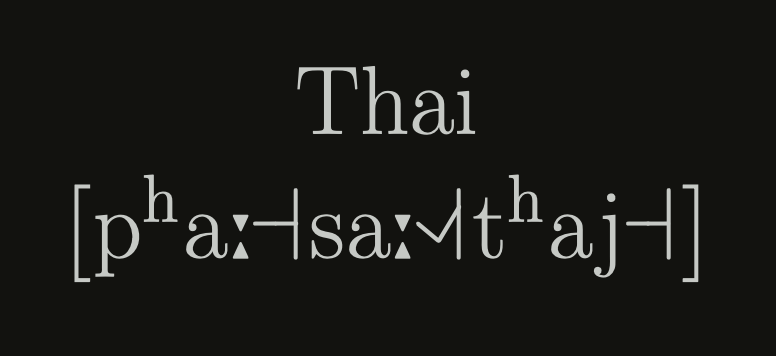

# bhasa

## Arabic

[arabic.pdf](typeset/arabic.pdf)

    

## Bengali

[bengali.pdf](typeset/bengali.pdf)

    

## Chinese

[chinese.pdf](typeset/chinese.pdf)

    

## Hindi-Urdu

[hindi-urdu.pdf](typeset/hindi-urdu.pdf)

    

<!-- ## Japanese -->
<!--  -->
<!-- [japanese.pdf](typeset/japanese.pdf) -->
<!--  -->
<!-- 
 -->
<!--      -->
<!-- 
 -->

## Korean

[korean.pdf](typeset/korean.pdf)

    

<!-- ## Malayalam -->
<!--  -->
<!-- [malayalam.pdf](typeset/malayalam.pdf) -->
<!--  -->
<!-- 
 -->
<!--      -->
<!-- 
 -->

<!-- ## Persian -->
<!--  -->
<!-- [persian.pdf](typeset/persian.pdf) -->
<!--  -->
<!-- 
 -->
<!--      -->
<!-- 
 -->

<!-- ## Punjabi -->
<!--  -->
<!-- [punjabi.pdf](typeset/punjabi.pdf) -->
<!--  -->
<!-- 
 -->
<!--      -->
<!-- 
 -->

## Tamil

[tamil.pdf](typeset/tamil.pdf)

    

## Telugu

[telugu.pdf](typeset/telugu.pdf)

    

## Thai

[thai.pdf](typeset/thai.pdf)

    

